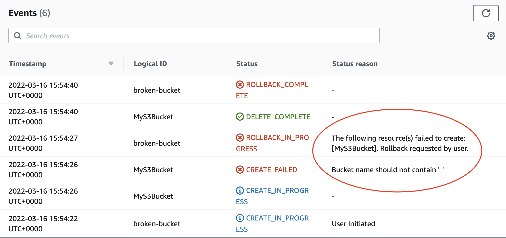

## AWS CloudFormation

---

### Overview

- Infrastructure as Code
- CloudFormation concepts
- CloudFormation Syntax and Features
- Deploying CloudFormation to AWS
- Troubleshooting CloudFormation
- Exercise

---

### Learning Objectives

- Explain why Infrastructure as Code is important
- Identify the parts of a CloudFormation Template
- Be able to write and deploy CloudFormation Templates to AWS

---

### Infrastructure as Code (IaC)

> Question: What is Infrastructure as Code?

Notes:
IaC may already have been covered as a concept in the DevOps module.

If this was the case, ask the learners if they remember anything about IaC.

Learners may mention:

- The management of infrastructure
- Generates the exact same environment every time through a code file
- Used in conjunction with CI/CD pipeline
- Without IaC, teams must maintain the settings of all environments individually

If the learners do not recall anything, move on to the next slides where it is covered.

---

### What is Infrastructure as Code?

- The management of _infrastructure_ through version-controlled files
- Generates the exact same environment every time through a code file
- Used in conjunction with CI/CD pipeline
- Without IaC, teams must maintain the settings of all environments individually

---

### What is "Infrastructure"?

In a traditional non-cloud context:

- Application Servers
- Virtual Machines
- Databases
- Firewalls
- etc

---

In an AWS cloud context, "Infrastructure" could be any component of any AWS service:

- S3 Buckets
- Lambda Functions
- EC2 compute instances
- Users
- Roles
- ... and much more

👉 Almost anything you can create through the AWS web console can be considered "infrastructure"!

Notes:
In AWS, almost anything can be managed easily as Infrastructure as Code. This is one of the big selling points of AWS which allows developers to work productively.

---

### Infrastructure as Code

Infrastructure as Code is an engineering principle in which we define **templates** for our **application and service infrastructure** to allow it to be created, deleted, re-created, or duplicated **consistently and predictably**

👉 There are many different IaC tools and technologies in the engineering world, but the goal and principle of IaC is always the same

Notes:
IaC lets us take a template that contains everything we need for our application, and deploy multiple instances of that application side-by-side.

We don't build our application infrastructure directly, instead we build a template which can then create that infrastructure for us when deployed.

---

### Infrastructure from Templates

 <!-- .element: class="centered" height="360px" -->

- One template can be deployed any number of times
- Deployed instances can be updated by modifying and re-deploying the template

Notes:
It may be useful to use the docker analogy with the learners; the same docker image can be used to create many docker containers that run the same software in the same way.

---

### Without Infrastructure as Code

- Each new deployment requires lots of human work to provision 😩
- There may be mistakes that aren't noticed and cause problems 😵
- The instructions to build an application can be lost or forgotten! 😱

---

### With Infrastructure as Code

- Any number of deployments created automatically with little work 😃
- Every deployment is identical, since it came from the same template 🤩
- The template is in source-control, so it can never be lost! 🎉

---

## Quiz Time! 🤓

---

### Why is Infrastructure as Code Important?

1. It reduces mistakes
1. It helps teams collaborate
1. It is automatable and repeatable
1. All of the above

Answer: `4`<!-- .element: class="fragment" -->

Notes:
All of these things

---

### When is it okay to NOT use IaC?

1. When you need to get new features added quickly on a deadline
1. When you are exploring or prototyping new functionality
1. When the client doesn't mind if you use it or don't
1. Never OK

Answer: `2 (Sometimes!)`<!-- .element: class="fragment" -->

Notes:
It's can be appropriate to use the AWS console to click some things together manually, as long as that functionality is never intended to be actually form part of any real application (even non-production applications!) and does not need to be replicated.

For all other scenarios we should use IaC from the very beginning, to ensure that we create software and services that are repeatably deployable.

Even if you are working with a client who "doesn't mind", as engineers it is OUR responsibility to adhere to and recommend best-practice ways of working for the client's benefit.

Even for a "prototype" app it might still best to use IaC for the same reasons it is in production; you can tear down your deployment and easily redeploy if anything goes wrong, and you can take the IaC configuration from the prototype and use it as the basis for what will become the production application.

---

### Infrastructure as Code Summary

- IaC makes deployments predictable and repeatable
- IaC makes collaborating with other people in your team on infrastructure easy
- You should **always** use IaC when building cloud apps and services

---

### Emoji Check:

Do you feel you've understood the core concepts of IaC (Infrastructure as Code)?

1. 😢 Haven't a clue, please help!
2. 🙁 I'm starting to get it but need to go over some of it please
3. 😐 Ok. With a bit of help and practice, yes
4. 🙂 Yes, with team collaboration could try it
5. 😀 Yes, enough to start working on it collaboratively

Notes:
The phrasing is such that all answers invite collaborative effort, none require solo knowledge.

The 1-5 are looking at (a) understanding of content and (b) readiness to practice the thing being covered, so:

1. 😢 Haven't a clue what's being discussed, so I certainly can't start practising it (play MC Hammer song)
2. 🙁 I'm starting to get it but need more clarity before I'm ready to begin practising it with others
3. 😐 I understand enough to begin practising it with others in a really basic way
4. 🙂 I understand a majority of what's being discussed, and I feel ready to practice this with others and begin to deepen the practice
5. 😀 I understand all (or at the majority) of what's being discussed, and I feel ready to practice this in depth with others and explore more advanced areas of the content

---

### AWS CloudFormation

- CloudFormation is an IaC tool designed by AWS for use within AWS
- It natively understands and works with (almost!) all AWS infrastructure and services
- CloudFormation runs as a service within AWS, which can orchestrate our deployments
- It is an industry-standard and popular choice for AWS development

---

### CloudFormation Key Concepts

- **Template** - A 'blueprint' for our infrastructure
- **Stack** - A deployed instance of a template
- **Resources** - Infrastructure components created inside a stack

---

### CloudFormation Key Concepts

 <!-- .element: class="centered" height="360px" -->

- When a template is deployed, it creates a stack containing the resources defined in that template

---

### A CloudFormation Template

```yaml
AWSTemplateFormatVersion: "2010-09-09"
Description: Template for a single S3 bucket

Resources:
  MyS3Bucket:
    Type: AWS::S3::Bucket
    Properties:
      BucketName: academy-de-example-bucket
```

The above template creates a S3 Bucket `resource` called 'academy-de-example-bucket'

---

### CloudFormation Anatomy (1)

```yaml
AWSTemplateFormatVersion: "2010-09-09" # <-- Version
Description: My S3 bucket # <-- Description
Resources:
  MyS3Bucket:
    Type: AWS::S3::Bucket
    Properties:
      BucketName: academy-de-example-bucket
```

- **Version** (Optional)
    - Always "2010-09-09" (only one version exists 🤷‍♀️)
- **Description** (Optional)
    - Human-readable description of what this template is for

---

### CloudFormation Anatomy (2)

```yaml
AWSTemplateFormatVersion: "2010-09-09"
Description: Template for a single S3 bucket

Resources: # <-= Resources
  MyS3Bucket:
    Type: AWS::S3::Bucket
    Properties:
      BucketName: academy-de-example-bucket
```

**Resources** (Required)

- The set of infrastructure to be created by this template
- Could be S3 buckets, EC2 instances, roles, lambda functions, or any other supported AWS resource

---

### CloudFormation Anatomy (3)

```yaml
AWSTemplateFormatVersion: "2010-09-09"
Description: Template for a single S3 bucket

Resources:
  MyS3Bucket: # <-- Resource Name
    Type: AWS::S3::Bucket # <-- Resource Type
    Properties:
      BucketName: academy-de-example-bucket
```

#### Resource Name

- A label for this resource
- Can be anything, as long as it is unique within the template

#### Resource Type

- The type of infrastructure this resource represents
- Comes from a fixed list of possible resource types

---

### CloudFormation Anatomy (4)

```yaml
AWSTemplateFormatVersion: "2010-09-09"
Description: Template for a single S3 bucket

Resources:
  MyS3Bucket:
    Type: AWS::S3::Bucket
    Properties:
      BucketName: my-bucket-name # <-- Resource Properties
```

#### Resource Properties

- Configuration for this type of resource
- Possible properties for a resource type can be found in the documentation
- Some properties are required, while others are optional

Notes:
Possible resource properties for an S3 bucket as example may include things like the name (specified here and required) plus optional properties such as:

- Whether encryption is applied on the bucket
- Public or Private access to bucket files
- Use of the bucket to host a website

---

### Points of Note

- Templates are YAML documents
- In YAML 👉 indentation is important 👈 (Just like in Python!)
- All possible AWS resource types and their possible properties can be found in the [AWS docs](https://docs.aws.amazon.com/AWSCloudFormation/latest/UserGuide/aws-template-resource-type-ref.html)

---

### Deploying a Template

We have a Template that defines our Resources.

How do we turn that template into a stack in AWS?

There are two main options:

1. Deploy via AWS Web Console
2. Deploy via the AWS Command Line Interface (CLI)

---

### Console Deployment

A stack can be created by uploading a template file via the Web interface, by going to:

- AWS Web Console
    - CloudFormation -> Stacks -> Create Stack

While a stack is deploying, the web console can be used to see what is happening.

The web console can also be used to check what resources have been created.

Notes:
Use the web console to demonstrate template deployment of the S3 bucket for the learners. You may need to change the bucket name!

Show the learners the deployment events in the console, to see what AWS is doing.

Show the learners the S3 bucket resource that has been actually created.

---

### Deployment Errors

What if the deployment doesn't work?

```yaml
Resources:
  MyS3Bucket:
    Type: AWS::S3::Bucket
    Properties:
      BucketName: generation_de_example_bucket
```

The above template has a problem. Errors in deployment can be viewed via the web console.

**Remember:** Identifying and understanding errors is a CRITICAL SKILL for an Engineer 👀

Notes:
The intent here is to prepare the learners for diagnosing errors in their own stacks.

Deploy the above template and demonstrate where to find deployment errors under the Events tab.

Bucket creation will fail because bucket names cannot contain underscores '_'

---

### Deployment Errors

 <!-- .element: class="centered" -->

Reasons for failure can be determined from the 'Events' pane.

---

## Quiz Time! 🤓

---

**In a CloudFormation Template, what does the `Resources` section define?**

1. Options that are passed into to the template
1. The set of infrastructure the template will create
1. Already-existing infrastructure that the template depends on

Answer: `2`<!-- .element: class="fragment" -->

Notes:
Options passed into the template are defined by parameters - this will be covered later in the module

---

**Which of the following is FALSE?**

1. A Template is a 'blueprint' for infrastructure
1. Templates can define one or more resources
1. A Stack is a deployed instance of a template
1. Stacks can be committed to source control

Answer: `4`<!-- .element: class="fragment" -->

Notes:
Stacks cannot be committed to source control as they are deployed instances of templates which contain actual resources.

The template is the blueprint for a stack which should be committed to source control.

---

### CLI Deployment

CloudFormation templates can also be deployed via the AWS Command Line Interface (CLI)

- Unlike the web interface, this can be easily invoked from a `shell script`
- This makes the CLI the preferred option to help automate deployments as part of a `CI/CD pipeline` 🤖

---

### CLI Deployment Process

 <!-- .element: class="centered" height="300px" -->

- S3 Deployment bucket stores the cloudformation template.
- Deployment bucket can be used to store any number of templates for different stacks.
- AWS CloudFormation is triggered to perform a deployment of the stored S3 template via the CLI.

Notes:
Learners may have difficulty understanding the purpose of the deployment bucket. (i.e. why is the template not just deployed 'directly'?)

There may also be confusion where learners think the S3 bucket created by the stack IS the deployment bucket. Reinforce that these are separate things and that the deploy bucket is created manually before any deployment activity happens.

Make it clear that the CLI itself does not "perform" or orchestrate the deployment, the CLI tells AWS CloudFormation (which runs inside AWS) to do a deployment, and where the template is found. This is why the template needs to be in a bucket, rather than on our local machine.

---

### Deploy a Stack with the CLI

1\. Create a deployment bucket with `s3 mb`

```sh
aws s3 mb s3://<bucket-name> --region eu-west-1
```

2\. Upload a Template with `s3 cp`

```sh
aws s3 cp <template>.yml s3://<bucket-name>/<template>.yml
```

3\. Create a Stack with `cloudformation create-stack`

```sh
aws cloudformation create-stack
--stack-name <cf-stack-name>
--template-url https://<bucket-name>.s3.eu-west-1.amazonaws.com/<template>.yml
--region eu-west-1
```

Notes:
It is more common to use the "deploy" sub command, as this has more functionality.

---

### A Different CloudFormation Template

- Let's have a look at the `handouts/webserver-start.yml` template
- What does this template define?

Notes:
Ask learners what they can determine about what this template will create.

Walk learners through the template.

---

### Deploying the Webserver Template with the CLI

1\. Upload Webserver stack template

```sh
aws s3 cp webserver.yml s3://<bucket-name>/webserver.yml
```

2\. Create 'ec2-webserver' stack referencing the uploaded template

```sh
aws cloudformation create-stack
--stack-name ec2-webserver
--template-url https://<bucket-name>.s3.eu-west-1.amazonaws.com/webserver.yml
--region eu-west-1
```

Notes:
Run the deployment and validate it is deployed correctly.

After deployment, the webserver will not be accessible as there is no ingress rule for HTTP. We will fix this with a stack update.

---

### The Webserver Doesn't Work 🙁

The webserver EC2 instance isn't able to show any content yet.

This is because it is missing a Security Group with a rule to allow network traffic from the Internet to the EC2 instance.

We can fix this by adding a SecurityGroup resource to the template.

Let's review `handouts/webserver-updated.yml`, which includes the security group updates needed.

---

### CloudFormation Anatomy (cont)

```yaml
Resources:
  Ec2Instance:
    Type: AWS::EC2::Instance
    Properties:
      InstanceType: t2.micro
      ImageId: ami-0db188056a6ff81ae
      SecurityGroups:
        - !Ref WebSecurityGroup # <-- Security Group Referenced Here

  WebSecurityGroup: # <-- Security Group Defined Here
    Type: AWS::EC2::SecurityGroup
    Properties:
      GroupDescription: Allows HTTP ingress on port 80
```

- A template can contain **any number** of `Resources` of **different types**
- When one resource depends on another resource, we can reference it by the name of the resource in the template; here 'WebSecurityGroup'

---

#### Point:

👉 Resources in a CloudFormation Stack are **NOT order-sensitive**

- Resources may appear in a Template in **any order**
- CloudFormation will automatically decide the correct order to create resources based on their **dependencies** on each other.

Notes:
Learners may sometimes assume from their experience writing Python that CloudFormation is similarly order-sensitive like Python code - it is worth clearing up that it is not.

CloudFormation template are processed by the CloudFormation service to create a set of steps that will be run to actually create resources.

Resources in the templates themselves can appear in any order.

In our example, CloudFormation will create the Security Group first because the EC2 instance depends on it, even though the Security Group comes later in the file.

---

### Updating a Stack

Any CloudFormation template can be modified to add, remove or change existing resources.

The deployed stack can then be updated, to make it match the new template. 🤩

👉 Resources that require creation or modification will be updated by CloudFormation. Resources with no changes are left alone.

---

### Update a Stack with the CLI

1. Update a stack with `cloudformation update-stack`

```sh
aws cloudformation update-stack
--stack-name <stack-name>
--template-url https://<bucket-name>.s3.eu-west-1.amazonaws.com/webserver.yml
--region eu-west-1
```

👉 When **updating** a stack, the `stack-name` must be the name of the existing stack to update

---

### Updating the Webserver Stack

1\. Upload the updated stack template

```sh
aws s3 cp webserver-updated.yml s3://<bucket-name>/webserver.yml
```

2\. Update the existing stack to match the new template

```sh
aws cloudformation update-stack
--stack-name ec2-webserver
--template-url https://<bucket-name>.s3.eu-west-1.amazonaws.com/webserver.yml
--region eu-west-1
```

Notes:
Webserver should now be accessible on its public IP

Console defaults to secure `https://` so you will need to change the link to insecure `http://` to access

---

### The "deploy" command

It is also common to use the `deploy` sub-command as this will do a create or update according to the state of the stack. Note here we can reference the local version of the template we want to deploy:

```sh
aws cloudformation deploy \
    --stack-name ec2-webserver \
    --template-file webserver.yml \
    --region eu-west-1
```

---

## Quiz Time! 🤓

---

### TRUE or FALSE?

#### Resources in a template must be defined in the order they need to be be created, from top to bottom

Answer: `FALSE - Resources can appear in any order.` <!-- .element: class="fragment" -->

Notes:
Resources can appear in any order

---

#### What is the behaviour of AWS CloudFormation when updating a stack?

1. The stack is removed and re-created
1. All resources in the stack are updated
1. Only resources that have changed are updated

Answer: `3`<!-- .element: class="fragment" -->

Notes:
CloudFormation will produce a change set based on the difference between the existing stack and the new template

---

## CloudFormation is great 🎉

But wait. There's more!

---

### More Features - Functions

CloudFormation has a number of built-in `Functions`

Functions allow values in the template to be manipulated when it is deployed.

As with functions in Python, CloudFormation functions take an `input`, and return an `output`.

---

### Functions

Some Functions:

- `!Ref`        - Gets a Reference to another resource
- `Fn::Sub`    - Substitutes placeholders in a value with other values
- `Fn::Join`   - Joins a set of values together into one value
- `Fn::Select` - Selects a single value from a list by index

There are [many functions available](https://docs.aws.amazon.com/AWSCloudFormation/latest/UserGuide/intrinsic-function-reference.html)

---

### Function Example - Ref

We have already seen an example of `Ref` in adding a security group to our webserver:

```yaml
Resources:
  Ec2Instance:
    Type: AWS::EC2::Instance
    Properties:
      ImageId: ami-0db188056a6ff81ae
      SecurityGroups:
        - !Ref WebSecurityGroup # <-- Security Group Referenced Here

  WebSecurityGroup: # <-- Security Group Defined Here
    Type: AWS::EC2::SecurityGroup
```

- `!Ref` here finds the ID value for the security group
- The ID value is necessary to assign the security group to the EC2 instance
- The ID value is not generated until the template is deployed, which is why this must be resolved with a function at deploy-time

---

### More Features - Parameters

Information can be passed into a stack from outside with `Parameters`

Parameters allow the stack to be customised:

- Resource options such as EC2 instance size can be specified
- Names for resources like S3 bucket can specified

This avoids the need to hard-code values that may need to change

👉 Parameters help make a stack more `generic` and `reusable`

Notes:
Stack parameters are very much like args into a python program, or args into a Unix script.

With parameters, we can avoid having to edit the stack body itself to make changes.

---

### Parameter Example

```yaml
Parameters: # <-- Parameters block
  TeamName: # <-- TeamName Parameter
    Type: String
    Description: Dev team name for this deployment
    Default: your-team-name

Resources:
  CafeDataS3Bucket:
    Type: AWS::S3::Bucket
    Properties:
      AccessControl: Private
      # Parameter is used:
      BucketName: !Sub generation-${TeamName}-cafe-data-bucket
```

- `TeamName` can be provided to the stack as an argument on the CLI
- If you add `Default`(s) then command line overrides are optional
- Using the `!Sub` function, the TeamName parameter is substituted into the value for BucketName

Notes:
From this example we can see how this same template could be used for multiple teams without needing to actually edit the template itself.

A more usual industry scenario for this pattern would be to parametrise based on the deployment target environment, e.g. dev bucket, test bucket, prod bucket.

---

### Exercise

1. Clone the following repository: <https://github.com/infinityworks/data-academy-cloudformation-example>
1. Follow instructions in the `README.md`

👉 It is recommended that you create a shell script (e.g. `deploy-template1.sh`) for each deployment.

- A script will make it easier to edit and update the deployment commands, when compared to working only in the terminal.

---

### Emoji Check:

How did you get on with the CF exercises?

1. 😢 Haven't a clue, please help!
2. 🙁 I'm starting to get it but need to go over some of it please
3. 😐 Ok. With a bit of help and practice, yes
4. 🙂 Yes, with team collaboration could try it
5. 😀 Yes, enough to start working on it collaboratively

Notes:
The phrasing is such that all answers invite collaborative effort, none require solo knowledge.

The 1-5 are looking at (a) understanding of content and (b) readiness to practice the thing being covered, so:

1. 😢 Haven't a clue what's being discussed, so I certainly can't start practising it (play MC Hammer song)
2. 🙁 I'm starting to get it but need more clarity before I'm ready to begin practising it with others
3. 😐 I understand enough to begin practising it with others in a really basic way
4. 🙂 I understand a majority of what's being discussed, and I feel ready to practice this with others and begin to deepen the practice
5. 😀 I understand all (or at the majority) of what's being discussed, and I feel ready to practice this in depth with others and explore more advanced areas of the content

---

### CloudFormation Caveats

In working through the exercises, you may have observed some pain points with `create-stack` and `update-stack` 😰

- It needs to be known in advance if a stack already exists to decide whether to perform a 'create' or 'update'
- Lambda function code zip files need to be manually uploaded to S3
- When uploading a zip file, the name of the zip must change each time. If it does not change, CloudFormation will not update the function code

---

### CloudFormation Package

This is the command to use to upload artefacts referenced by your template. It can also create zip files of your lambda code:

```sh
aws cloudformation package \
--template-file https://<bucket-full-url>/my-stack-definition.yml \
--s3-bucket my-deployment-bucket \
--output-file-name my-stack-definition-packaged.yml
```

This makes an interim stack definition file that references the items it uploaded.

Notes:
Recent versions will zip your lambda code if the template points has "AWS::Lambda" types with the "Code" parameter filled in

---

### CloudFormation Deploy revisited

A convenient solution to the use of `update/create` is to use `deploy`. It will:

- Automatically determine if a stack needs to be created or updated 🎉

But also:

- Automatically discover Lambda function code zip files in local filesystem, and upload them to S3 🤩
- Automatically randomise uploaded zip file names to ensure code is updated 😎

[Deploy documentation & Examples](https://awscli.amazonaws.com/v2/documentation/api/latest/reference/cloudformation/deploy/index.html)

---

### CloudFormation Deploy revisited

So, if we use `deploy` after a `package`, we can use the interim template it made to make life easier:

```sh
aws cloudformation deploy \
    --stack-name ec2-webserver \
    --template-file my-stack-definition-packaged.yml \
    --region eu-west-1
```

---

### Overview - recap

- Infrastructure as Code
- CloudFormation concepts
- CloudFormation Syntax and Features
- Deploying CloudFormation to AWS
- Troubleshooting CloudFormation
- Exercise

---

### Learning Objectives - recap

- Explain why Infrastructure as Code is important
- Identify the parts of a CloudFormation Template
- Be able to write and deploy CloudFormation Templates to AWS

---

### Further Reading

- [Cloudformation Docs](https://aws.amazon.com/cloudformation/getting-started/)
- [CloudFormation Resource Types](https://docs.aws.amazon.com/AWSCloudFormation/latest/UserGuide/aws-template-resource-type-ref.html)
- [CloudFormation Functions](https://docs.aws.amazon.com/AWSCloudFormation/latest/UserGuide/intrinsic-function-reference.html)
- [CloudFormation Deploy](https://awscli.amazonaws.com/v2/documentation/api/latest/reference/cloudformation/deploy/index.html)

---

### Emoji Check:

On a high level, do you think you understand the main concepts of this session? Say so if not!

1. 😢 Haven't a clue, please help!
2. 🙁 I'm starting to get it but need to go over some of it please
3. 😐 Ok. With a bit of help and practice, yes
4. 🙂 Yes, with team collaboration could try it
5. 😀 Yes, enough to start working on it collaboratively

Notes:
The phrasing is such that all answers invite collaborative effort, none require solo knowledge.

The 1-5 are looking at (a) understanding of content and (b) readiness to practice the thing being covered, so:

1. 😢 Haven't a clue what's being discussed, so I certainly can't start practising it (play MC Hammer song)
2. 🙁 I'm starting to get it but need more clarity before I'm ready to begin practising it with others
3. 😐 I understand enough to begin practising it with others in a really basic way
4. 🙂 I understand a majority of what's being discussed, and I feel ready to practice this with others and begin to deepen the practice
5. 😀 I understand all (or at the majority) of what's being discussed, and I feel ready to practice this in depth with others and explore more advanced areas of the content
