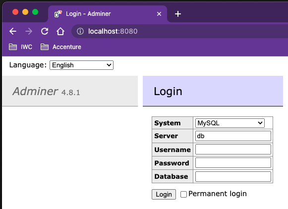
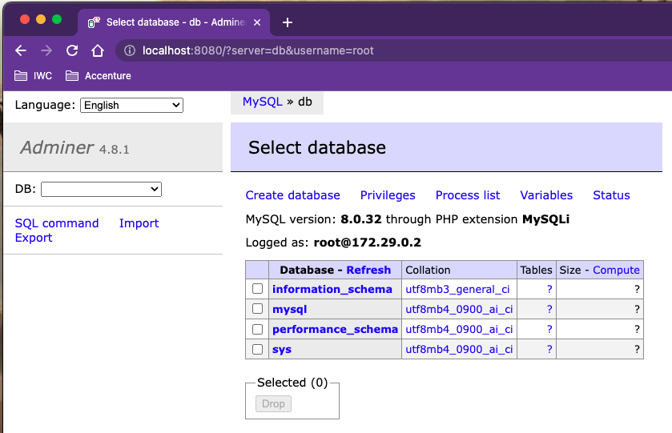
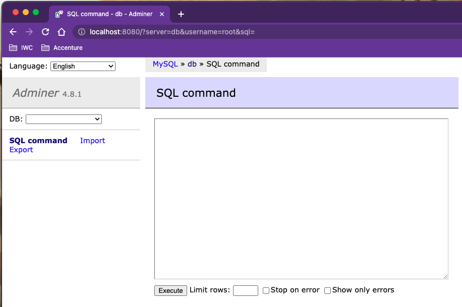
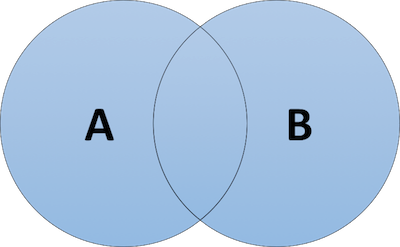
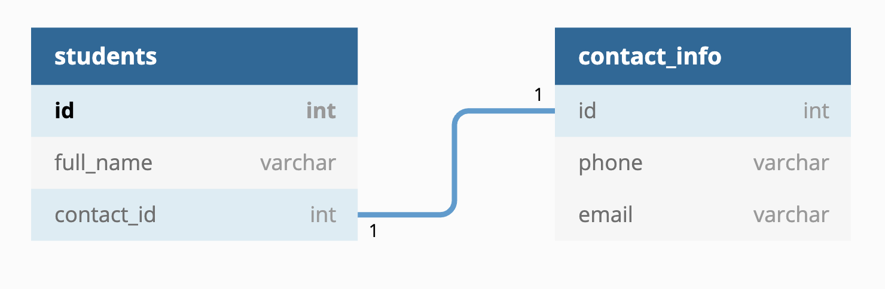
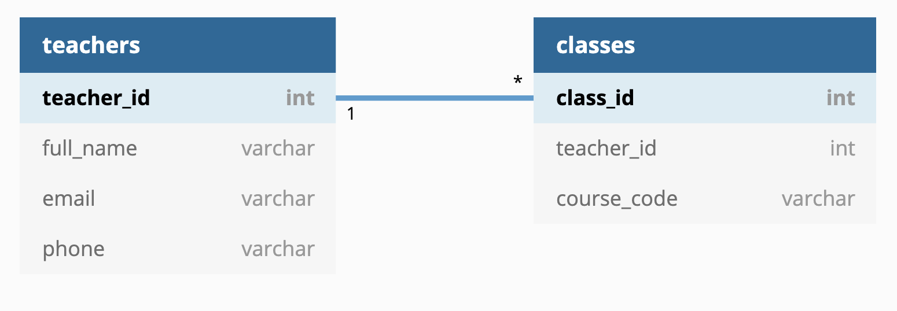
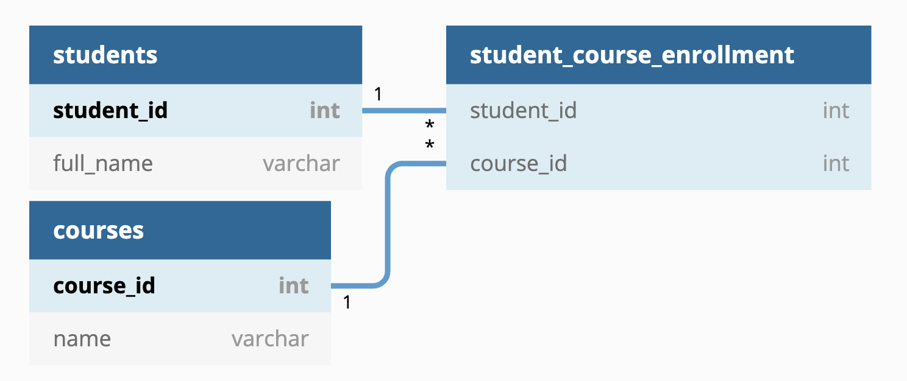

## Databases

---

### Overview

- What is a database?
- SQL
- DDL / DML
- Modelling
- Connecting to a database from Python

---

### Learning Objectives

- Explain what a database is and how to utilise one
- Describe SQL and it's categories, DDL and DML
- Identify modelling relationships in data
- Setup your own database and interact with it using Python

---

### What is a Database?

_A structured set of data held in a computer, especially one that is accessible in various ways._

---

Databases typically follow a client-server architecture:

<!-- .element: class="centered" -->

The client might be:

- A command line tool
- GUI tool
- A library for a programming language

---

### Aspects of a Database

**Schema**: The information about the structure of the database and how things relate to each other

**Table**: Holds a collection of columns and rows

**Column**: A set of values of a particular data type (e.g. string or int)

**Row**: An entry in a table (sometimes called a record)

**Cell**: A single value at the intersection between a row and a column (sometimes called a field)

**Constraints**: Automatically restrict what data can appear in a column

---

### Why do we need a database?

- Storing data in memory risks data loss
- Big files are slow to read and write
- Small files adds complexity to your application
- Integrity of data is easier to maintain
- Data security is easier to manage

---

### So, how can we utilise one?

We can use an **RDBMS**. Otherwise known as a **Relational DataBase Management System**.

They allow us to work with tables and the relationships between them, typically through an application.

---

### RDBMS Examples

- Microsoft SQL Server
- MySQL
- Oracle
- PostgreSQL

We will be using MySQL for this module.

---

### SQL

#### Structured Query Language

- **THE** language for querying relational databases
- Declarative, not imperative
- i.e tell it what to do, not how to do it

Notes:
Declarative: Building a program where we define the logic of a computation without describing its control flow.

Imperative: uses statements that change a program's state (like Python).

We will see some actual SQL further down.

---

### SQL Data Types

#### Like Python, SQL has data types:

**CHAR**: A _fixed_-length string with a 0-255 character size that is defined on table creation.

**VARCHAR**: A _variable_-length string with a 0-65535 size.

**BOOL**: Zero is false, one is true.

**INT**: An integer value.

**DECIMAL**: An exact fixed-point number.

---

### SQL Data Types

**DATE**: A date format.

**TIME**: A time format.

**DATETIME**: A date-time format.

All of these types are for **MySQL**. Different SQL providers can have different data types so be careful.

There are also [plenty more data types](https://www.w3schools.com/sql/sql_datatypes.asp) out there, but we don't need to know them all right now.

---

### DDL

**Data Definition Language**.

- Deals with database schemas and descriptions, and how the data should reside in the database

DDL handles these commands:

- **CREATE** - create database/table
- **ALTER** - alters the structure of existing database/table
- **DROP** - deletes tables from a database
- **TRUNCATE** - remove all records from a table
- **COMMENT** - add comments similar to Python
- **RENAME** - rename a table

---

### Create Database

```sql
CREATE DATABASE name_of_db;
```

---

### Create Table

Structure

```sql
CREATE TABLE < table name > (
column1 < type >,
column2 < type >,
.
.
.
);
```

---

### Example

```sql
CREATE TABLE person (
  person_id INT NOT NULL AUTO_INCREMENT,
  first_name VARCHAR(100) NOT NULL,
  last_name VARCHAR(100) NOT NULL,
  age INT,
  PRIMARY KEY(person_id)
);
```

Notes:
We will come back to primary key.

---

### Keywords

`NOT NULL`: Do not allow this field to be null when inserting a new record.

`AUTO_INCREMENT`: Tells MySQL to add the next available number when inserting a new record. This will make more sense on the next slide.

---

### ALTER TABLE

If you need to amend a table's design, you can do the following:

```sql
ALTER TABLE person
ADD email varchar(255);
```

You can add or drop columns for instance.

---

### DROP TABLE

You can remove a table entirely:

```sql
DROP TABLE person;
```

This is an operation which isn't used frequently, so be careful!

---

### Emoji Check:

Do you feel you understand the basics of databases? Say so if not!

1. 😢 Haven't a clue, please help!
2. 🙁 I'm starting to get it but need to go over some of it please
3. 😐 Ok. With a bit of help and practice, yes
4. 🙂 Yes, I think I get it
5. 😀 Yes, no problem

Notes:
The phrasing is such that all answers invite collaborative effort, none require solo knowledge.

The 1-5 are looking at (a) understanding of content and (b) readiness to practice the thing being covered, so:

1. 😢 Haven't a clue what's being discussed, so I certainly can't start practising it (play MC Hammer song)
2. 🙁 I'm starting to get it but need more clarity before I'm ready to begin practising it with others
3. 😐 I understand enough to begin practising it with others in a really basic way
4. 🙂 I understand a majority of what's being discussed, and I feel ready to practice this with others and begin to deepen the practice
5. 😀 I understand all (or at the majority) of what's being discussed, and I feel ready to practice this in depth with others and explore more advanced areas of the content

---

### Exercise

> Instructor to distribute the database session zip file.

- Extract the zip file
- You should have the following folders:
    - `exercises`
    - `handouts`
    - `solutions` (no peeking!)

Notes:
Make sure everyone has done this

---

### Exercise

> If using podman, set up podman desktop and `podman-compose`

- Ensure podman desktop is installed for your platform, see [https://podman-desktop.io/docs/installation](https://podman-desktop.io/docs/installation)
- Once podman desktop is set up and a virtual machine is running, install `podman-compose` via the podman desktop UI, via `Settings > Resources > Compose Tile`

---

### Exercise

> Ensure docker or podman is running

- The rest of the slides use `docker` commands.
- If you are using `podman`, ask your instructor to help you set up an alias for podman so it points at docker: `alias docker="podman"`
- The following commands should all work in your terminal:
    - `docker --version`
    - `docker pull mysql adminer`
    - `docker image ls`
        - in this list you should see "mysql" and "adminer"

Notes:
Make sure everyone has done this.

Everyone should already have the "mysql" and "adminer" images downloaded from the previous session.

---

### Exercise

> Ensure no old containers are docker running. We need to clean up from any previous Docker work.

- Run `docker ps -a`
- If you have anything running, stop it with `docker stop <container_name>`
- Remove all old containers with `docker rm <container_name>`
- Run `docker ps -a` again - you should have zero containers now!

Notes:
Make sure everyone has done this.

Make sure everyone has stopped and removed all old containers.

---

### Exercise

- Open a terminal in the  `handouts` directory.
- Run `docker compose up -d`
- You should get something similar to the following output:

```sh
Creating mysql_container   ... done
Creating adminer_container ... done
```

Notes:
Make sure everyone has done this

---

### Exercise

- Browse to the <http://localhost:8080/> to open the `Adminer` page

You should see the Adminer homepage:

<!-- .element: class="centered" -->

Notes:
Make sure everyone has done this

---

### Exercise

- Log in with username `root` and password `password`

You should see the Adminer system tables:

<!-- .element: class="centered" -->

Notes:
Make sure everyone has done this

---

### Exercise

- Click on the "SQL Command" link

You should see the Adminer SQL Command page:

<!-- .element: class="centered" -->

Now we're ready to use some SQL!

Notes:
Make sure everyone has done this

---

### Exercise

> Complete `Part 1 - using DDL` in the exercise handout.
>
> Create a database, a table, and alter the table.

Notes:
Make sure everyone has done this

---

### Emoji Check:

How did you find exercises on creating and working with databases?

1. 😢 Haven't a clue, please help!
2. 🙁 I'm starting to get it but need to go over some of it please
3. 😐 Ok. With a bit of help and practice, yes
4. 🙂 Yes, I think I get it
5. 😀 Yes, no problem

Notes:
The phrasing is such that all answers invite collaborative effort, none require solo knowledge.

The 1-5 are looking at (a) understanding of content and (b) readiness to practice the thing being covered, so:

1. 😢 Haven't a clue what's being discussed, so I certainly can't start practising it (play MC Hammer song)
2. 🙁 I'm starting to get it but need more clarity before I'm ready to begin practising it with others
3. 😐 I understand enough to begin practising it with others in a really basic way
4. 🙂 I understand a majority of what's being discussed, and I feel ready to practice this with others and begin to deepen the practice
5. 😀 I understand all (or at the majority) of what's being discussed, and I feel ready to practice this in depth with others and explore more advanced areas of the content

---

### DML

**Data Manipulation Language**.

- Deals with data manipulation, and includes most common SQL statements
- Used to store, modify, retrieve, delete and update data in database.

DML handles these commands (and more):

- **SELECT** - retrieve data from one or more tables
- **INSERT** - insert data into a table
- **UPDATE** - updates existing data within a table
- **DELETE** - delete all records from a table

---

### INSERT

Inserts a row into your table:

```sql
INSERT INTO person (first_name, last_name, age)
  VALUES ('Jane', 'Bloggs', 32);
INSERT INTO person (first_name, last_name, age)
  VALUES ('Joe', 'Bloggs', 28);
```

- Any non-null fields are required as a value
- Any field not provided with a value will default to null

---

### Exercise

> Complete `Part 2.1 - INSERT` in the exercise handout.
>
> Only do part 2.1!

Notes:
Tell everyone to only do "Part 2.1 - INSERT".

A breakout of 10 mins works well here.

---

### Discussion - INSERT

> Did we all get some data inserted?
>
> What problems did you have?

Notes:
Check if anyone had syntax problems, problems with single double quotes, and so on - any problems people had is good feedback for the other learners.

---

### UPDATE

A way to change a row that is already stored:

```SQL
UPDATE person SET age = 25 WHERE first_name = 'Joe'
```

---

### DELETE

Deletes a row given certain conditions:

```sql
DELETE FROM person WHERE first_name = 'Joe'
```

---

### SELECTing Data

This is the skeleton command for selecting data:

```sql
SELECT ...

FROM ...

WHERE ...

ORDER BY ...

LIMIT ...
```

Only `SELECT` and `FROM` are required, the rest are optional but allow for more refined queries.

---

### SELECT

Specifies which fields to return and takes a comma-separated list of field names:

```sql
SELECT first_name, last_name, age
```

`*` represents all columns in the table:

```sql
SELECT *
```

---

### FROM

Specifying which table you're querying against:

```sql
SELECT first_name, last_name, age
FROM person
```

---

### WHERE

Specifying a predicate that evaluates whether a row should be returned. Can take in wildcard matching:

```sql
SELECT *
FROM person
WHERE age = 25
```

Notes:
Predicate in layman's terms means applying a filter.

---

## Complex WHERE

You can build where clauses that use boolean operators.

You can compound the boolean operators for even more fun!

```sql
SELECT * FROM person
WHERE first_name = "Mike"
AND (surname = "Goddard" OR age >= 28);
```

---

### ORDER BY

Specifying the order in which the data is returned.

Optionally, the direction of the order can be appended.

Can add multiple columns on which to order:

```sql
SELECT *
FROM person
WHERE age = 25
ORDER BY first_name DESC
```

Notes:
DESC or ASC determines if the results will be provided top-to-bottom or bottom-to-top.

---

### LIMIT

Limits the number of records returned:

```sql
SELECT *
FROM person
WHERE age = 25
ORDER BY first_name DESC
LIMIT 10
```

---

### Exercise

> Complete `Part 2.2 - UPDATE` in the exercise handout.
>
> Only do part 2.2!

Notes:
Tell everyone to only do "Part 2.2 - UPDATE".

A breakout of 10 mins works well here.

---

### Discussion - UPDATE

> Did we all get some data updated?
>
> What problems did you have?

Notes:
Check if anyone accidentally updated all the rows, had syntax problems, problems with single double quotes, and so on - any problems people had is good feedback for the other learners.

---

### Exercise

> Complete `Part 2.3 - DELETE` in the exercise handout.
>
> Only do part 2.3!

Notes:
Tell everyone to only do "Part 2.3 - DELETE".

A breakout of 10 mins works well here.

---

### Discussion - DELETE

> Did we all get some data inserted?
>
> What problems did you have?

Notes:
Check if anyone accidentally deleted all rows, had syntax problems, problems with single double quotes, and so on - any problems people had is good feedback for the other learners.

---

### Exercise

> Complete `Part 2.4 - SELECT` in the exercise handout.
>
> Only do part 2.4!

Notes:
Tell everyone to only do "Part 2.4 - SELECT".

A breakout of 10 mins works well here.

---

### Discussion - SELECT

> Did we all get some data selected?
>
> What problems did you have?

Notes:
Check if anyone has accidentally deleted all rows so nothing came in the SELECT, or Updated all rows to be the same!

Check if anyone had syntax problems, problems with single double quotes, and so on - any problems people had is good feedback for the other learners.

---

### Emoji Check:

How did you find exercises on adding entries to a table and selecting data?

1. 😢 Haven't a clue, please help!
2. 🙁 I'm starting to get it but need to go over some of it please
3. 😐 Ok. With a bit of help and practice, yes
4. 🙂 Yes, I think I get it
5. 😀 Yes, no problem

Notes:
The phrasing is such that all answers invite collaborative effort, none require solo knowledge.

The 1-5 are looking at (a) understanding of content and (b) readiness to practice the thing being covered, so:

1. 😢 Haven't a clue what's being discussed, so I certainly can't start practising it (play MC Hammer song)
2. 🙁 I'm starting to get it but need more clarity before I'm ready to begin practising it with others
3. 😐 I understand enough to begin practising it with others in a really basic way
4. 🙂 I understand a majority of what's being discussed, and I feel ready to practice this with others and begin to deepen the practice
5. 😀 I understand all (or at the majority) of what's being discussed, and I feel ready to practice this in depth with others and explore more advanced areas of the content

---

### Primary Key

- A special table column (or combination of columns) that uniquely identify each record
- Every row must have a PK and must be unique
- Often a self-incrementing number
- Cannot be `null`

```sql
CREATE TABLE person (
  person_id INT NOT NULL AUTO_INCREMENT,
  PRIMARY KEY(person_id)
);
```

Notes:
Demo this in Adminer

Add some rows, show how the restrictions apply

---

### Foreign Key

- A column (or combination of columns) that provides a link between two tables
- Acts as a cross-reference between two tables as it references the PK of another table
- Must always reference a PK

```sql
CREATE TABLE contact_info(
  id INT NOT NULL AUTO_INCREMENT,
  person_id INT,
  phone VARCHAR(15),
  email VARCHAR(100),
  PRIMARY KEY(id),
  FOREIGN KEY(person_id) REFERENCES person(person_id)
);
```

Notes:
Demo this in Adminer

Add some rows, show how the restrictions apply

---

### Emoji Check:

Do you feel you understand the basics of DDL (Insert, update, delete and select)? Say so if not!

1. 😢 Haven't a clue, please help!
2. 🙁 I'm starting to get it but need to go over some of it please
3. 😐 Ok. With a bit of help and practice, yes
4. 🙂 Yes, I think I get it
5. 😀 Yes, no problem

Notes:
The phrasing is such that all answers invite collaborative effort, none require solo knowledge.

The 1-5 are looking at (a) understanding of content and (b) readiness to practice the thing being covered, so:

1. 😢 Haven't a clue what's being discussed, so I certainly can't start practising it (play MC Hammer song)
2. 🙁 I'm starting to get it but need more clarity before I'm ready to begin practising it with others
3. 😐 I understand enough to begin practising it with others in a really basic way
4. 🙂 I understand a majority of what's being discussed, and I feel ready to practice this with others and begin to deepen the practice
5. 😀 I understand all (or at the majority) of what's being discussed, and I feel ready to practice this in depth with others and explore more advanced areas of the content

---

### Quiz Time! 🤓

---

**Which of these describes an entry in a table?**

1. Field
1. Column
1. Record
1. Table

Answer: `3`<!-- .element: class="fragment" -->

---

**Which of these best describes DDL?**

1. Deals with database schemas and descriptions, and how the data should reside in the database.
1. Deals with storage of data, modifications, retrievals, deletes and updates in a database.
1. Specifies which fields to return in a query and takes a comma-separated list of field names.
1. A special table column (or combination of columns) that uniquely identify each record.

Answer: `1`<!-- .element: class="fragment" -->

---

### JOINs

A `JOIN` clause is used to combine rows from two or more tables, based on a relation between them.

---

### Example 1

```sql
SELECT first_name, email
FROM person
JOIN contact_info
ON person.person_id = contact_info.person_id
```

Notes:
Demo this in Adminer

---

### Example 2

```sql
SELECT p.first_name, c.email
FROM person p
JOIN contact_info c
ON p.person_id = c.person_id
```

You can alias table names variables which are typically first-letter abbreviations.

Notes:
Demo this in Adminer

---

### Example 3

```sql
SELECT p.first_name, c.email, d.veggie
FROM person p
JOIN contact_info c ON p.person_id = c.person_id
JOIN dietary_reqs d ON p.person_id = d.person_id
```

You can use multiple joins.

Notes:
Demo this in Adminer

---

### INNER JOIN

Returns records that have a matching value on both tables

<!-- .element: class="centered" -->

---

### LEFT/RIGHT OUTER JOIN

Returns all records from the left table, and the matched records on the right table.

And vice versa!

<!-- .element: class="centered" -->

---

### FULL OUTER JOIN

Returns all records when there is a match in either left or right table.

<!-- .element: class="centered" -->

---

### Demo

> Let's have a look as sample Joins in the `handouts/joins-cheatsheet.md` handout.

Notes:
Show-and-tell to the class.

---

### Follow Along - JOINs Prep

> Complete `Part 3.1 - Database setup` in the exercise handout.

- Copy and paste the sql queries from `handouts/join_exercises_setup.sql` into the `Adminer` SQL command window
- Click the 'execute' button
- Switch to new db `join_exercises`
- Run the two `SELECT` statements in it again to check you have the data

Notes:
get everyone to follow along while you do this

---

### Exercise - JOINs

> Complete `Part 3 - Joins` in the exercise handout.

Notes:
Tell everyone to only do "Part 3 - Joins".

A breakout of 20 mins works well here.

---

### Emoji Check:

Do you feel you understand how to perform a `JOIN` as part of the `SELECT` statement? Say so if not!

1. 😢 Haven't a clue, please help!
2. 🙁 I'm starting to get it but need to go over some of it please
3. 😐 Ok. With a bit of help and practice, yes
4. 🙂 Yes, I think I get it
5. 😀 Yes, no problem

Notes:
The phrasing is such that all answers invite collaborative effort, none require solo knowledge.

The 1-5 are looking at (a) understanding of content and (b) readiness to practice the thing being covered, so:

1. 😢 Haven't a clue what's being discussed, so I certainly can't start practising it (play MC Hammer song)
2. 🙁 I'm starting to get it but need more clarity before I'm ready to begin practising it with others
3. 😐 I understand enough to begin practising it with others in a really basic way
4. 🙂 I understand a majority of what's being discussed, and I feel ready to practice this with others and begin to deepen the practice
5. 😀 I understand all (or at the majority) of what's being discussed, and I feel ready to practice this in depth with others and explore more advanced areas of the content

---

### Functions

Some useful functions you may want to use:

SUBSTRING

```sql
SELECT SUBSTRING(string, start, length) AS new_string;
```

AVERAGE, MIN, MAX

```sql
SELECT MIN(price) AS smallest_price FROM products;
```

---

### Functions

CURRENT\_DATE

```sql
SELECT CURDATE()
```

COUNT

```sql
SELECT COUNT(product_id) AS NumberOfProducts FROM products;
```

Again, there are [plenty of functions](https://www.w3schools.com/sql/sql_ref_mysql.asp) that aren't covered here.

---

### Exercise - Functions

> Experiment using functions in your select statements

Some examples:

- Select the MIN and MAX values of your ids
- Select a partial description or name
- Select the current date
- Select the number of people

Notes:
A breakout of 10 mins works well here.

---

### Discussion - Functions

> Did we all get some data selected?
>
> What problems did you have?

Notes:
Check if anyone had syntax problems, problems with single double quotes, and so on - any problems people had is good feedback for the other learners.

---

### Relationships

When creating a database, we use separate tables for different types of entities (_customer_, _order_, _item_).

We also need to have relationships between these tables. For instance, customers make orders, and orders contain items. These relationships need to be represented in the database.

Different kinds of relationships can exist between records:

- One-to-one
- One-to-many
- Many-to-many

---

### One-to-One

Imagine we have a table of students and another table of their contact information:

<!-- .element: class="centered" height="250px" -->

- **One** student has **one** set of contact details
- The `id` fields in each table are the primary keys
- The `contact_id` field in `students` is a foreign key on `contact_info`

---

### One-to-Many

Imagine we have a table of teachers and a table of classes:

<!-- .element: class="centered" height="250px" -->

- **One** teacher can teach **many** classes
- A teacher can teach many classes, but a class can only have one teacher (in this scenario)

---

### Many-to-Many

Imagine we have a table of students and a table of courses.

- **Many** students can take **many** courses
- Many-to-Many relationships are tricky to construct, so one way to simplify it is to have an intermediary table for course enrolment

<!-- .element: class="centered" height="250px" -->

---

## Theory

There are some key database principles it is helpful to look at before we move on.

---

### ACID

Acid refers to a standard set of properties that **guarantee** database transactions are processed reliably.

More importantly, it is concerned with how a database **recovers** from any failure during a transaction.

ACID-compliant databases ensure that the database remains accurate and consistent.

More on this, but first - _what is a transaction_?

---

### Transaction

A unit of work that is treated as a whole. It either has to happen in full or not at all.

Example: Imagine transferring money from one bank to another. This requires multiple steps:

1. Withdraw from the source account
1. Deposit it to the destination account

The operation has to succeed in full. Stopping halfway could mean money is lost.

---

## ACID Acronyms Explained

---

### Atomicity

Guarantees that all of the transaction succeeds, or none of it does.

An atomic system must guarantee atomicity in every situation, including power failures, errors and crashes.

---

### Consistency

Guarantees that all data stays consistent, as in, the data will be valid according to all of the rules defined on the database.

A transaction should only bring the database from one **valid** state to another.

---

### Isolation

Guarantees that all transactions occur in isolation. No transactions should affect any other transactions.

Multiple transactions are often executed concurrently (reading and writing to a table at the same time).

Isolation ensures that this concurrent execution of transaction leaves the database in the same state if the transactions were executed sequentially (one at a time).

For example, a transaction cannot read data from any transaction that is yet to complete.

---

### Durability

Once a transaction is committed, it will remain in the system, even if there's a system crash.

If we tell a user that a transaction succeeded, it must be factual.

This normally means that completed transactions are recorded to long-term memory like a hard drive.

---

### CAP

A theorem that states it is impossible for a distributed data store to simultaneously provide more than two out of the following three guarantees:

**Consistency**: Every read receives the most recent write or an error.

**Availability**: Every request receives a (non-error) response, without the guarantee that it contains the most recent write

**Partition Tolerance**: The system continues to operate despite an arbitrary number of messages being dropped (or delayed) by the network between nodes

---

### CAP

No distributed system is safe from network failures, so partition tolerance needs to be tolerated.

We're left with deciding consistency over availability.

---

### CAP

When choosing consistency, the system will return an error if particular information can't be guaranteed to be up to date due to network failure.

When choosing availability, the system will always process the query and try to return the most recent available version of the information, even if it cannot guarantee it is up to date due to network failure.

When there is no network failure, both can be satisfied.

---

### CAP

CAP is frequently misunderstood as if we have to choose to abandon one of the three guarantees at all times.

In fact, the choice is really between consistency and availability only when a network partition or failure happens; at all other times, no trade-off has to be made.

---

### NoSQL

- Refers to any non-relational DB
- Came about in the late 2000s as cost of storage vary dramatically
- As it decreased, it allowed us to store way more data, which could be structured or unstructured
- Cloud computing has driven NoSQL for it's ability to distribute data across multiple servers and regions around the world

---

## NoSQL DB Types

---

### Document DB

- Stores data in documents similar to JSON objects
- Each document contains pairs of fields and values, like dictionaries in Python
- Documents map to objects in your code easily
- No need to decompose data across multiple tables, or use JOINs
- Dynamic schema, can change as you go along
- Faster querying of data (not always though)
- Distributed at their core
- MongoDB and CouchDB are popular choices

---

### Key-Value DB

- Each item contains a key and values
- A value can only be retrieved by referencing its key
- Great for storing large amounts of data but don't need to perform complex queries to retrieve it
- Redis and DynamoDB are popular choices

---

### Wide-Column Store

- Stores data in tables, rows and dynamic columns
- Provide a lot of flexibility over relational DBs because each row is not required to have the same columns
- Great for when you need to store large amounts of data and you can predict what your query patterns will be
- Cassandra and HBase are popular choices

---

### Graph DB

- Stores data in nodes and edges
- Nodes store information about people, places etc.
- Edges contain information about the relationships between nodes
- Great for when you need to traverse relationships to look for patterns like social networks and fraud detection
- Example: Twitter followers or LinkedIn connections
- Neo4j and JanusGraph are popular choices

---

### So why do we need them?

Dynamic schema - no set structure

Auto-sharding - distribution of the data across servers

Auto replication - allows for high availability

The move to smaller distributed services means not relying on one central DB

Easily scalable - more servers means more replication and load balancing

---

## They're not the silver bullet

- Sacrificing strong guarantees (which we will see next slide)
- Transactions aren't always supported
- You can end up stuck in the "relational" way of thinking when using them

---

### Quiz Time! 🤓

---

**Which type of relationship uses an intermediary table?**

1. One-to-One
1. One-to-Many
1. Many-to-One
1. Many-to-Many

Answer: `4`<!-- .element: class="fragment" -->

---

**How does a many-to-many relationship differ from the other two kinds of relationships?**

1. Primary key fields are used for both sides of the relationship.
1. Three tables are used instead of two tables.
1. You can't use referential integrity.
1. No primary key fields are used.

Answer: `2`<!-- .element: class="fragment" -->

Notes:
Three tables are used to create a many-to-many relationship, whereas the other two types of relationships only use two tables.

Choice A is incorrect because the one-to-one relationship is the only relationship that uses only primary key fields.

Choice C is wrong because you can use referential integrity with many-to-many relationships.

Choice D is incorrect because both primary and foreign key fields are used to make up a many-to-many relationship.

---

**Which of these is NOT a NoSQL database?**

1. DocumentDB
1. Postgres
1. GraphDB
1. Wide-Column Store

Answer: `2`<!-- .element: class="fragment" -->

---

**Which of the below best describe atomicity?**

1. Once a transaction is committed, it will remain in the system, even if there's a system crash.
1. Ensures that concurrent execution of transactions leaves the database in the same state if the transactions were executed sequentially (one at a time).
1. Allowing a transaction to only bring the database from one valid state to another.
1. Guarantees that all of the transaction succeeds, or none of it does.

Answer: `4`<!-- .element: class="fragment" -->

Notes:
1 talks about durability.
2 talks about isolation.
3 talks about consistency.

---

**Which of the below best describe isolation?**

1. Once a transaction is committed, it will remain in the system, even if there's a system crash.
1. Allowing a transaction to only bring the database from one valid state to another.
1. Ensures that concurrent execution of transactions leaves the database in the same state if the transactions were executed sequentially (one at a time).
1. Allowing for concurrent execution of data (reading and writing to a table at the same time).

Answer: `3`<!-- .element: class="fragment" -->

Notes:
1 talks about durability.
2 talks about atomicity.
4 is a red herring.

---

### A front-to-back system

Databases like MySQL are the "backend" of most systems - they provide the persistent storage (and can also do various calculations for us).

We have been using Adminer as a "front end" on our data (especially when running Select statements).

Typically, we will write that front-end ourselves - which means connecting to the database from our Python code.

Notes:
We don't cover Views (to re-represent our data or present calculated outputs) or Stored Procedures (to provide advanced functionality, logic or calculations) here.

---

### Python code and databases

We will need our python code to:

- Make a connection to the database
- Query the data from it with a `SELECT` statement (or, later, `INSERT`, or `UPDATE`)
- Present the results to us on-screen

Notes:
This is a simplified list!

---

### Python code and databases

> What data might the python code need in order to perform those steps?

- Address of the server<!-- .element: class="fragment" -->
- Port of the server<!-- .element: class="fragment" -->
- Name of the database<!-- .element: class="fragment" -->
- Name of the table<!-- .element: class="fragment" -->
- Query parameters (for WHERE, ORDER BY, etc)<!-- .element: class="fragment" -->

These are usually passed in as environment variables.

Notes:
This is a simplified list!

---

### SQL in Python

The library [`pymysql`](https://pypi.org/project/PyMySQL/) is a pure-Python MySQL client library - we can use it to connect and run our SQL, i.e. allow us to interact with a database purely through Python.

Notes:
We do not need install this separately, it is in the "requirements.txt" file already!

---

### Sample requirements.txt

A sample is pre-prepared for us.

> Let's look inside `handouts/requirements.txt`

This contains a sample set of useful libraries we will use.

Notes:
Show this to everyone

---

### Exercise - requirements

> Everyone do `Part 4.1 - requirements` now

- Open a terminal in folder `handouts`
- Activate a new virtual env
- Install the dependencies from `requirements.txt` with:
    - `python3 -m pip install -r requirements.txt` (Mac / Unix) or;
    - `py -m pip install -r requirements.txt` (Windows)

Notes:
Make sure everyone does this ok

---

### Using env vars

We do not usually want sensitive information like connection details or passwords in our python files!

A special file called `.env` can be made with dummy values for our testing, which will have real values in production systems.

In production systems, these values can be created without them ever being saved in our code.

---

### Using env vars

A standard way to write our code is use the `dotenv` utility to load them from the `.env` file. They can then be accessed in our application like so:

```py
from dotenv import load_dotenv

# Load environment variables from .env file
load_dotenv()
host_name = os.environ.get("mysql_host")
database_name = os.environ.get("mysql_db")
user_name = os.environ.get("mysql_user")
user_password = os.environ.get("mysql_pass")
```

Notes:
Make sure everyone does this ok

---

### Making a connection

The `pymysql` utility has a `connect()` function for creating a connection :

```py
connection = pymysql.connect(
    host = host_name,
    database = database_name,
    user = user_name,
    password = user_password
)
```

(This code assumes we have the variables `host_name, database_name, user_name, user_password` from the previous slide)

Notes:
Note that this is the simple form - on the next slide we use a Context, which is preferred

---

### Making a connection "properly"

We should use a _context_ for the connection, like so:

```py
try:
    with pymysql.connect(
        host = host_name, database = database_name,
        user = user_name, password = user_password
        ) as connection:

        # More code here
        ...

        # The connection will automatically close here
except Exception as ex:
    print('Failed to:', ex)
```

Notes:
This is the "neat" way to do it.

The exception message will print something useful if/when the code fails.

---

### Opening a cursor

A cursor is an object that lets us manipulate the database, in the context of a database operation:

The function to create one is on the `connection` object, like so:

```py
cursor = connection.cursor()
```

We can use this to run queries (SQL) on the database.

---

### An insert query

For inserting data, we give the `execute()` function some SQL with placeholders in it, and a tuple of all the data, like so:

```py
sql = """
    INSERT INTO table_name (column_1, column_2, numeric_3)
    VALUES (%s, %s, %s)
"""
data_values = ('value_1', 'value_2', 1234)

cursor.execute(sql, data_values)
```

The `execute()` function will do string substitutions for us in order - but we need to match the correct number of columns in the INSERT clause, VALUES clause, and tuple.

---

### Committing the data

"Committing" in database terms means "save any updates".

Adminer has been doing this for us - in code we need to do this ourselves, like so:

```py
connection.commit()
```

---

### Selecting data

To select data we also use a cursor. This will return all the matching data to us:

```py
cursor.execute('SELECT column_1, column_2 FROM table_name')
rows = cursor.fetchall()
```

We can also use any other valid clauses like `WHERE`, `ORDER BY`, and SQL functions.

---

### Select results

The result we get (`rows` here) will be an array with an entry per row.

Each row will also be an array, of the column values, e.g:

```py
rows = [
    ['row1_col1_value', 'row1_col2_value'],
    ['row2_col1_value', 'row2_col2_value']
]
```

...and so on. The data type in the array will depend on that of the columns (i.e. strings, numbers, booleans).

---

### Tidying up

When we are done with a cursor or connection, we need to close each of them to release the resources they are holding onto:

```py
# Closes the cursor so will be unusable from this point
cursor.close()
```

We only need to manually close the connection if we didn't use a context:

```py
# Closes the connection to the DB, ALWAYS do this
connection.close()
```

---

### Exercise prep - standard table

> The instructor will give you the sql in file `solutions/person_database.sql`

- This has a database called `test`
- And inside that, a table called `person`
- It matches the values in the `handouts/.env` file

**If** you **don't** have a table matching this, please run all this sql in Adminer.

Notes:
Make sure everyone has the standard "person" table in and knows their database name.

---

### Exercise prep - skeleton file

> The instructor will show you the file

- A template file `handouts/my_db_app.py` is provided
    - It already has the imports
    - It already loads the environment variables from an `.env` file
- The file doesn't do anything... yet!
    - It won't compile until it is filled in

Notes:
Make sure everyone has found the file - show them it and walk through it

---

### Exercise

> Complete the steps described in `Part 4.2 - add more code` in `database-exercises.md`

- Check your `.env` file has values matching your database name and table name
    - If not, update it to match or run the sample sql
- Edit the `my_db_app.py` file
    - Add the missing code as per the `TODO` sections
- Run your file to test it!

---

### Discussion

> How did you get on connecting to the database, querying it, and showing the data?

---

### Example of using context

The PyMySQL docs have a nice example of using a context for a connection and another for a cursor.

- https://pymysql.readthedocs.io/en/latest/user/examples.html#examples

...This is the sort of thing one does outside of this exercise :-)

---

### Terms and Definitions - recap

**Database**: An organised collection of data, generally stored and accessed electronically from a computer system.

**Relational Database**: A digital database based on the relational model of data.

**SQL**: A domain-specific language used in programming and designed for managing data held in a relational database management system.

**Query**: A precise request for information retrieval with database and information system.

---

### Terms and Definitions - recap

**DDL**: A data description language is a syntax for creating and modifying database objects such as tables, indexes, and users.

**DML**: A data manipulation language is a computer programming language used for inserting, deleting, and updating data in a database.

**Primary Key**: A specific choice of a minimal set of attributes (columns) that uniquely specify a tuple (row) in a relation (table).

**Foreign Key**: A set of attributes in a table that refers to the primary key of another table.

---

### Overview - recap

- What is a database?
- SQL
- DDL / DML
- Modelling
- Connecting to a database from Python

---

### Learning Objectives - recap

- Explain what a database is and how to utilise one
- Describe SQL and it's categories, DDL and DML
- Identify modelling relationships in data
- Setup your own database and interact with it using Python

---

### Further Reading

- [Learn SQL with Code Academy](https://www.codecademy.com/learn/learn-sql)
- [Database Design](https://blog.devart.com/sql-database-design-basics-with-example.html)
- [pymysql](https://pypi.org/project/PyMySQL/)
- [Database definitions](https://en.wikipedia.org/wiki/Relational_database#Terminology)
- [Database definitions discussion](https://dba.stackexchange.com/questions/65609/column-vs-field-have-i-been-using-these-terms-incorrectly)

---

### Emoji Check:

On a high level, do you think you understand the main concepts of this session? Say so if not!

1. 😢 Haven't a clue, please help!
2. 🙁 I'm starting to get it but need to go over some of it please
3. 😐 Ok. With a bit of help and practice, yes
4. 🙂 Yes, I think I get it
5. 😀 Yes, no problem

Notes:
The phrasing is such that all answers invite collaborative effort, none require solo knowledge.

The 1-5 are looking at (a) understanding of content and (b) readiness to practice the thing being covered, so:

1. 😢 Haven't a clue what's being discussed, so I certainly can't start practising it (play MC Hammer song)
2. 🙁 I'm starting to get it but need more clarity before I'm ready to begin practising it with others
3. 😐 I understand enough to begin practising it with others in a really basic way
4. 🙂 I understand a majority of what's being discussed, and I feel ready to practice this with others and begin to deepen the practice
5. 😀 I understand all (or at the majority) of what's being discussed, and I feel ready to practice this in depth with others and explore more advanced areas of the content
