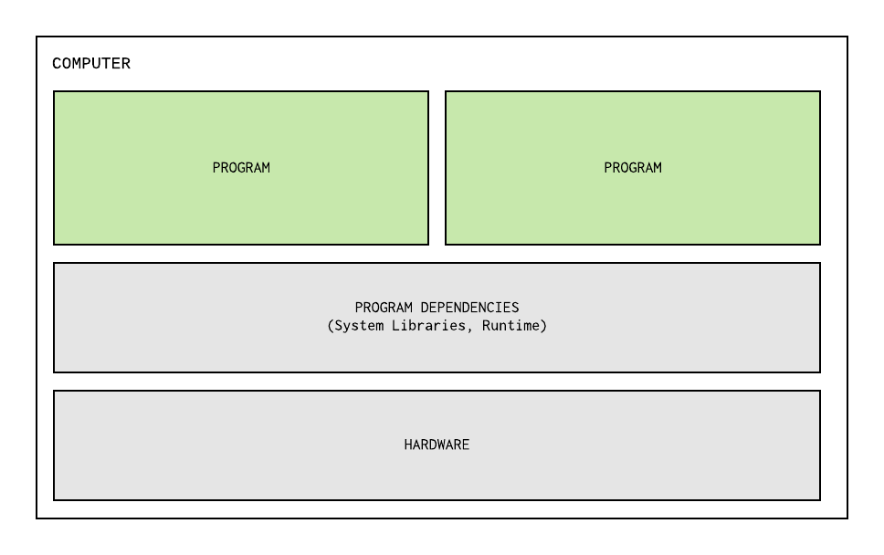
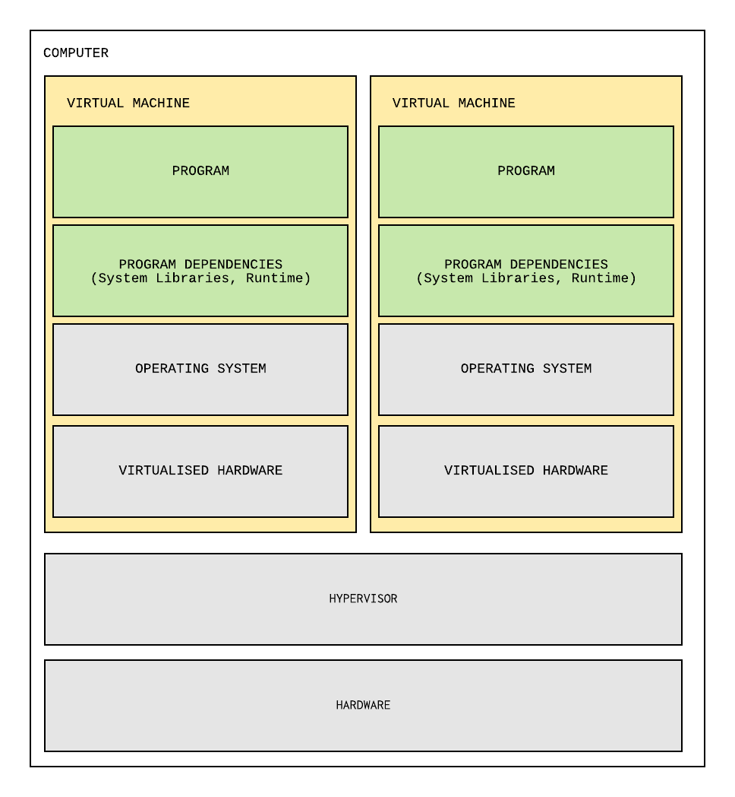
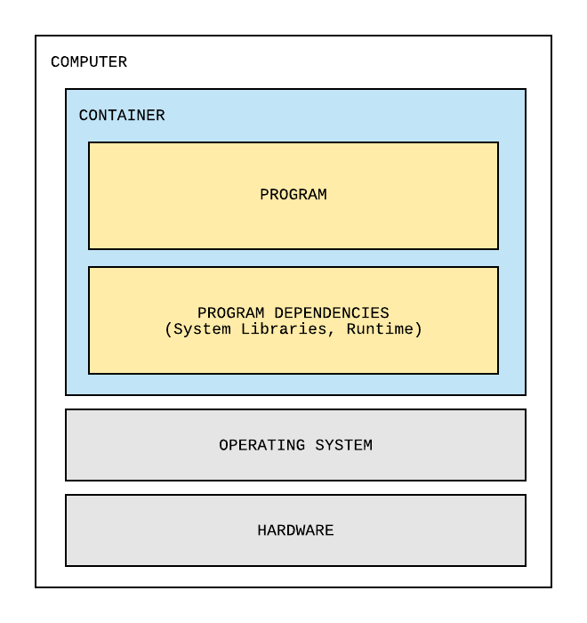
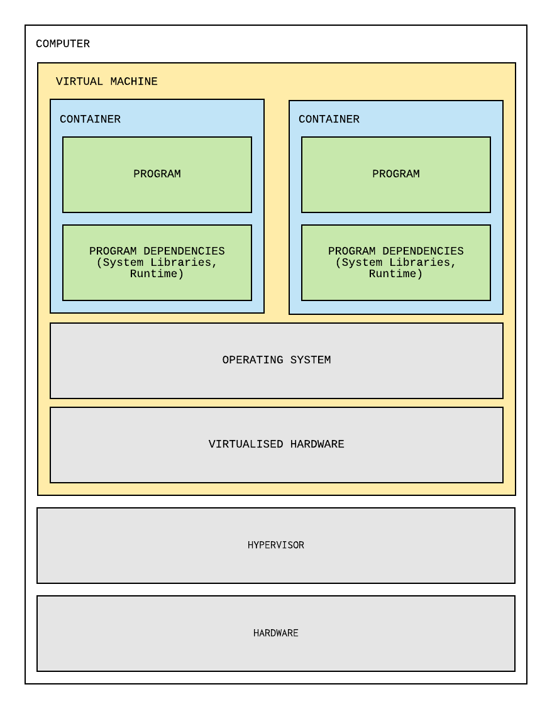

## Docker

---

<!-- .element: class="centered" height="400px"-->

Notes:
The official Docker mascot.

ASK: What does the logo remind you of? What's it trying to look like?

- Cargo ship carrying shipping containers. No coincidence.

ASK: Shipping containers absolutely revolutionised the world freight industry. Why?

- All the same size, can stack and easily secure
- Self contained, there aren't any loose parts sticking out.
- All your stuff is together in one container, you won't lose any of it
- Infrastructure is all set up to understand and work with containers (Cranes at the loading docks, trucks perfectly sized to transport them etc)

Docker has done the same thing for software delivery, and we'll see more about that today.

---

## Overview

- A Brief History of Software Delivery
- An Introduction to Docker
- Commands to work with Docker containers
- Creating your own Docker containers
- Sharing your containers with the world

---

## Learning Objectives

- Explain the benefits of images and containers
- Use commands to start, stop and log into containers
- Understand the structure of a Dockerfile and be able to write one
- Demonstrate how Docker Compose can create and run multi-container applications

---

### Lots of follow-along

> In this session there will be lots of chance to follow-along with what the instructor does so you can practice too.

---

### The History of Software Delivery

_Or, how we ended up with Docker._

---

### Multitasking operating systems (1960 - 1990)

Install many programs to disk and run them on demand

<!-- .element: class="centered" -->

Notes:

- Multiple programs can run simultaneously
- Linking dependencies can cause problems
- Processes are not isolated, which means they can interfere with each other

---

### Virtualisation (1990 - 2010s)

Can isolate dependencies in individual VMs (virtual machines)

<!-- .element: class="centered" -->

Notes:

- A physical computer can host multiple virtual computers
- Each virtual machine has its own OS, libraries, and programs
- Uses a hypervisor, to manage the various virtual machines running on the host hardware

---

### Virtualisation (1990 - 2010s) Pro's and Con's

- Each VM runs its own OS, using a lot of system resources
- Each VM emulates the underlying hardware, using yet more resources
- Still in many cases can save money on computer hardware
- A decent trade off when catering to a large number of users

---

### Enter Docker (2013 - Now)

<!-- .element: class="centered" -->

Notes:
Docker whale having a nice party with Tux the penguin and the Go Gopher.

Docker is written in the Go programming language.

Tux is the Linux mascot, and Docker runs on Linux.

---

### What is Docker?

Docker is a tool designed to make it easier to create, deploy, and run applications by using **containers**.

Containers allow a developer to package up an application with all of the parts it needs, such as libraries and other dependencies, and ship it all out as one package.

Notes:
Docker makes containers possible by using certain features of Linux to present a virtual filesystem to a running application process, and thereby sandbox it from other processes.

---

### Containers

Isolate applications and all of their dependencies with none of the overhead of VMs.

<!-- .element: class="centered" -->

Notes:
Containers don't have the same overhead as virtual machines because there is no guest operating system.

When you run Docker on Windows or Mac, all containers share a single virtual linux operating system which provides basic functionality.

Some features of linux are specific to each container however (such as the filesystem).

---

## Why containers?

- Provide a self-contained environment to develop and deploy applications
- Isolates application dependencies
- Lightweight in comparison to VMs
- Can easily 'transport' containers and run them on any machine

---

<!-- .element: class="centered" -->

Notes:
The self-contained nature of containers is of great use to us as developers in running, building and packaging our applications.

Imagine trying to distribute your mini-project for people to use. You'd have to zip up the whole project (or put it in version control), send it off, unzip it and run all of the commands to sort dependencies out.

There might be differences between your system setup, and the setup that someone else is using that means different people get different results, even when they follow the setup instructions the same way.

With Docker, a container allows us to package a fully working version of our application, and run it easily on any other Docker host, with complete consistency.

---

### Quiz Time! 🤓

> We're about to have a go with Docker, but before that, a quiz!

Notes:
We're about to get into having a go with Docker, but before that, a quiz.

---

**True or False: A Container has an entire copy of an Operating System (OS) inside it.**

Answer: `False`<!-- .element: class="fragment" -->

Notes:
Container shares the OS with the host machine, which is why all containers are Linux-based and run on a Linux host (or a Linux VM)

---

**Which of the following statements is FALSE?**

1. Containers can improve security if a running application is compromised or hacked
2. Containers often use more memory and CPU than Virtual Machines
3. Containers help prevent "Dependency Hell"

Answer: `2`<!-- .element: class="fragment" -->

Notes:
2 is false. They (usually) use less.
Less memory: because there is no need for a whole copy of the operating system
Less CPU: because there are none of the OS-level background housekeeping processes

---

### Running Docker

Make sure Docker Desktop is running.

You can use your terminal to check if Docker is running:

```sh
# Get Docker version
$ docker version

# ps = 'process status', i.e. see running containers
$ docker ps
```

Notes:
Can use your WSL terminal (Start -> Ubuntu) or can use Command Prompt

Demo this to everyone. You may need to find an ID with "docker ps -a"

Get everyone to repeat after you.

---

### Container Images

Container images describe the type of container to run.

An image could contain software such as a web-server or database, or our own applications we have written.

Just like with Python libraries, there are thousands of images already available online which we can download and use.

An image is referenced by its name.

Notes:
We'll see an example of pulling a container from a registry later

---

### Launching Containers

```sh
# Example usage
$ docker run [flags] <image> [args]

# Actual usage
$ docker run docker/whalesay cowsay Hello!
```

```text
< Hello! >
 --------
     \
      \
                    ##        .
              ## ## ##       ==
           ## ## ## ##      ===
       /""""""""""""""""___/ ===
  ~~~ {~~ ~~~~ ~~~ ~~~~ ~~ ~ /  ===- ~~~
       \______ o          __/
        \    \        __/
          \____\______/
```

Notes:
Explain flags and args:

Flags - control options for docker itself and how it behaves when running the container

Args - options passed into the program that you're running inside the container

Also cover briefly what an image is; the type of container to run. Could be a linux distro, a webserver, your own application, anything.

Demo this to everyone. You may need to find an ID with "docker ps -a"

Get everyone to repeat after you.

---

### Flags, Images and Arguments

- Flags - control options for docker itself and how it behaves when running the container
- Image name - tells Docker what to run
- Args (Arguments) - options passed into the program that you're running inside the container, like a webserver or database

---

### Container vs Image

- The Docker Image is the binary definition of what we want to run
- The Docker Container is the running software

For example, on your laptop will be a file called `chrome.exe` or `word.exe`. These binary files are the definition of the program we want to run. This is like the static _image_.

When we open it (i.e. run it), we get a web browser or word processor. This is like the running _container_.

Notes:
"chrome.exe" would be th file on Windows, on Mac it will be "chrome.app", etc.

---

### Container IDs

Every container has a unique ID we can use to refer to it instead of its name. We can see these with the command `docker ps`:

```sh
$ docker ps

CONTAINER ID     IMAGE     ...more...
31d16fa3edb2     ubuntu    ...more...
949316a32b9f     mysql     ...more...
```

We can also see stopped containers with `docker ps -all`

Notes:
Tell the class they won't see anything currently unless they do `-all` because their container has run and automatically stopped when it finished what it was doing.

Container table shortened as it's too wide for the slide.

---

### Stopping containers

When a container is running, we can stop it. We can also remove and restart them:

```sh
# Stop a container
$ docker stop <container_id | name>

# Remove a stopped container
$ docker rm <container_id | name>

# Restart a container
$ docker restart <container_id | name>
```

Notes:
Demo this to everyone. You may need to find an ID with "docker ps -a"

Get everyone to repeat after you.

---

### Exercise prep

> Instructor to give out zip file of `handouts`

Everyone please extract this, it has a folder `handouts` in it with files we will use.

---

### Exercise - running vs stopped

In a second terminal run `docker ps -a` between these commands and note what it reports.

In your first terminal:

- Run `docker run -d -p 3306:3306 -e MYSQL_ROOT_PASSWORD=pass --name my-sql mysql`
- Run `docker exec -it my-sql sh`
- Run `echo "hello I am inside my db"`
- Run `exit`
- Run `docker stop my-sql`
- Run `docker rm my-sql`

_On the following slides we'll look at what all the commands mean._

Notes:
Do this yourself first.

Note how the mysql container stays running.

Mention the "-d" detached flag.

Breakouts work well for this. Put the TEXT of the slide where folks can copy it!

Approx 5-10 mins.

---

### Emoji Check:

Did you all mange to start and stop a container and see its state change. Could you do it again?

1. 😢 Haven't a clue, please help!
2. 🙁 I'm starting to get it but need to go over some of it please
3. 😐 Ok. With a bit of help and practice, yes
4. 🙂 Yes, with team collaboration could try it
5. 😀 Yes, enough to start working on it collaboratively

Notes:
The phrasing is such that all answers invite collaborative effort, none require solo knowledge.

The 1-5 are looking at (a) understanding of content and (b) readiness to practice the thing being covered, so:

1. 😢 Haven't a clue what's being discussed, so I certainly can't start practising it (play MC Hammer song)
2. 🙁 I'm starting to get it but need more clarity before I'm ready to begin practising it with others
3. 😐 I understand enough to begin practising it with others in a really basic way
4. 🙂 I understand a majority of what's being discussed, and I feel ready to practice this with others and begin to deepen the practice
5. 😀 I understand all (or at the majority) of what's being discussed, and I feel ready to practice this in depth with others and explore more advanced areas of the content

---

### Logging into our containers

We need to pass in the `-it` flags (`--rm` deletes the container automatically on exit):

```sh
$ docker run --rm -it debian

root@dba9683049bd:/ # You're now in Debian!

$ echo "hello I am in debian"
$ exit
```

Notes:
Show you're now in Debian e.g:

`cat /etc/os-release`

`whoami`

---

### exec

Run commands in running containers with the `exec` command

```sh

# Run a command in an already running container
$ docker exec -it <container_id> <command>

# Launch a bash shell in a container
$ docker exec -it 654321 bash
```

Notes:
Unlike starting a container in interactive mode, this container won't stop when you exit the bash shell.

Demo this to everyone. You may need to find an ID with "docker ps -a"

Get everyone to repeat after you.

---

### Running Background Containers

When we run a container, by default it is `attached` to the current terminal - and we see the output from it.

You can run a container as a background task in `detached` mode.

All output is hidden inside the container, and the container is non-interactive.

```sh
# Run container as an attached foreground task
$ docker run docker/whalesay cowsay Hello!

# Run container as a detached - no output
$ docker run -d docker/whalesay cowsay Hello!
```

Notes:
This is also sometimes called running a process as a "daemon"

Just for fun and trivia, a daemon is originally a lesser deity or guiding spirit, originally in Greek religion and mythology.

In terms of modern culture references, this would be like The Borrowers, little people who run around your house when you aren't looking, moving your belongings around.

In computing terms then, a daemon isn't a main 'foreground' program which the user is interacting with graphically, but a helper program that runs performing some task in the background, unseen.

Demo this to everyone. You may need to find an ID with "docker ps -a"

Get everyone to repeat after you.

---

### Seeing container logs

When a container is running in the background, we can still see its logs as follows:

```sh
# Print the logs from the container to your terminal:
$ docker logs [-f] <container_id>

# E.g.
$ docker logs 31d16fa3edb2

# And to "watch" the logs with the "follow" flag:
$ docker logs -f 31d16fa3edb2
```

Notes:
Demo this to everyone. You may need to find an ID with "docker ps -a"

Get everyone to repeat after you.

---

### Emoji Check:

Did you all manage to see some logs?

1. 😢 Haven't a clue, please help!
2. 🙁 I'm starting to get it but need to go over some of it please
3. 😐 Ok. With a bit of help and practice, yes
4. 🙂 Yes, with team collaboration could try it
5. 😀 Yes, enough to start working on it collaboratively

Notes:
The phrasing is such that all answers invite collaborative effort, none require solo knowledge.

The 1-5 are looking at (a) understanding of content and (b) readiness to practice the thing being covered, so:

1. 😢 Haven't a clue what's being discussed, so I certainly can't start practising it (play MC Hammer song)
2. 🙁 I'm starting to get it but need more clarity before I'm ready to begin practising it with others
3. 😐 I understand enough to begin practising it with others in a really basic way
4. 🙂 I understand a majority of what's being discussed, and I feel ready to practice this with others and begin to deepen the practice
5. 😀 I understand all (or at the majority) of what's being discussed, and I feel ready to practice this in depth with others and explore more advanced areas of the content

---

### Port Binding

In order to connect to apps like your web browser (Chrome, Edge, etc), those apps have open _ports_ to talk on. Our Containers do this too, so they can talk to each other. We can _bind_ our machine's ports to those in the containers, so we can "talk" to them too.

This lets us run services like web servers and databases in isolated containerised environments and access them as if they were local:

```sh
$ docker run -p host_port:container_port <image>

# the port binding here is "-p 3306:3306"
$ docker run -d -p 3306:3306 \
    -e MYSQL_ROOT_PASSWORD=pass --name my-sql mysql
```

Notes:
ASK: Does anyone know what a 'port' is, in the context of computer networking?

Explain ports. Use 80/443 as an example. Show we can connect to 443 on google.com but it doesn't work if we specify a different port because the webserver isn't running there.

Numbered ports allow us to run multiple network services on the same machine without those services conflicting with each other.

---

### Using names not Ids

Using the Container ID is one way to control it and start and stop it.

More common is to set the _name_ of your container, with the `--name` flag:

```sh [6]
$ docker run --name <custom_name> <image>

# Here the name is "--name my-sql"
$ docker run -d \
    -e MYSQL_ROOT_PASSWORD=pass \
    --name my-sql \
    mysql
```

If we don't set the name, Docker will generate a random one - which is fine for temporary use, but not predictable for tests or scripting!

Notes:
Demonstrate the random names from "docker ps -a"

---

### Environment variables

We can pass environment variables to our container with the `-e` flag, for example `-e MYSQL_ROOT_PASSWORD=pass`:

```sh
$ docker run -d -p 3306:3306 \
    -e MYSQL_ROOT_PASSWORD=pass \
    --name my-sql mysql
```

---

### Exercise: Run a Database

- Start a database instance with the following command:

```sh
$ docker run -d -p 3306:3306 -e MYSQL_ROOT_PASSWORD=pass \
    --name my-sql mysql
```

- Confirm the container is running using `docker ps`
- Try and start another instance with the exact same command.
- It won't work! Identify the problem from the error message.
- Change the startup command to fix the problem and allow another database to run at the same time
- Confirm both containers are running using `docker ps`
- Stop both containers

Notes:
Both the external port and name need to be unique!

Breakouts work well for this.

Approx 5-10 mins.

---

### Emoji Check:

Did you mange to start and stop a database container?

1. 😢 Haven't a clue, please help!
2. 🙁 I'm starting to get it but need to go over some of it please
3. 😐 Ok. With a bit of help and practice, yes
4. 🙂 Yes, with team collaboration could try it
5. 😀 Yes, enough to start working on it collaboratively

Notes:
The phrasing is such that all answers invite collaborative effort, none require solo knowledge.

The 1-5 are looking at (a) understanding of content and (b) readiness to practice the thing being covered, so:

1. 😢 Haven't a clue what's being discussed, so I certainly can't start practising it (play MC Hammer song)
2. 🙁 I'm starting to get it but need more clarity before I'm ready to begin practising it with others
3. 😐 I understand enough to begin practising it with others in a really basic way
4. 🙂 I understand a majority of what's being discussed, and I feel ready to practice this with others and begin to deepen the practice
5. 😀 I understand all (or at the majority) of what's being discussed, and I feel ready to practice this in depth with others and explore more advanced areas of the content

---

### Volume Mounting

This lets us designate a directory in our local filesystem to be shared with a container. For example, we can run some sql files when the database starts up:

```sh
$ docker run -v <host_dir>:<container_dir> <image>

$ docker run -d -v \
  /home/user/some-sql-files:/var/lib/mysql mysql

$ docker run -d -v \
  "$PWD/some-sql-files:/var/lib/mysql" mysql
```

Notes:
Tell the class NOT to try following along with this one!

Relative path mounting on MacOS is as follows:

$ docker run -d -v "$PWD/some-sql-files:/var/lib/mysql" mysql mysql

---

### Quiz Time! 🤓

---

**True or false: You can create multiple containers from the same image.**

Answer: `True`<!-- .element: class="fragment" -->

---

**What command would you run to get a list of running containers?**

1. `docker exec`
2. `docker inspect`
3. `docker ps`
4. `docker service`

Answer: `3`<!-- .element: class="fragment" -->

Notes:

1. `docker exec` runs a command inside a container
2. `docker inspect` is used to get info about a running container
4. `docker service` is used to manage applications defined into services running on a docker cluster, not relevant for our use case

---

**How would you permanently remove a running container?**

1. `docker rm <c_id>`
2. `docker kill <c_id>`
3. `docker pause <c_id> && docker rm <c_id>`
4. `docker stop <c_id> && docker rm <c_id>`

(Here `<c_id>` refers to a container ID).

Answer: `4`<!-- .element: class="fragment" -->

Notes:

1. Cannot remove a container while it is still running
2. Kills a container but does not remove it (Also, kill versus stop: stop issues SIGTERM for safe termination asking the app to close gracefully, kill issues SIGKILL for forced termination)
3. Pause attempts to suspend a container, can't remove a container when it is suspended
4. Safely stop, and then remove (could also kill and then remove)

---

### Components of a Docker Image

- The basis of containers
- Consists of the system libraries, system tools and platform settings
- They are built-in layers which represent the commands of a Dockerfile
- When an image is run, it becomes a container

```sh
# List images
$ docker image ls
```

---

### Dockerfile

- Docker can build images automatically by reading the instructions from a **Dockerfile**
- A Dockerfile is a text document that contains all the commands to assemble an image

---

## Structure of a Dockerfile

`FROM` - what base image we are using

`WORKDIR` - the directory in the image that will contain our files

`COPY` - what files we want copied into the image

`RUN` - any commands we want to run (apt-get install, update etc.)

`EXPOSE` - what ports we want to make available outside our container

`ENTRYPOINT` - what gets executed when starting a container

`CMD` - a command to run when the container is started

Full Dockerfile reference information is here:
https://docs.docker.com/engine/reference/builder/

Notes:
Not all of these things are needed for a Dockerfile, depending on what you are trying to do.

There are also more things that are not covered here.

Common container layers are also shared between container instances, saving resources.
If you have several containers all based on Ubuntu version x, then only a single copy of Ubuntu version x is required.

---

### Dockerfile example

```dockerfile
FROM python:3
WORKDIR /usr/src/app
COPY /app .
RUN pip install -r requirements.txt
CMD python ./app.py
```

Notes:
Walk through what each command does

---

### Building a Dockerfile

A Dockerfile can be built into an image that we can then run.

This command will look for a file called `Dockerfile` in the current directory, and build it:

```sh
$ docker build .
```

To tag the image (give it a meaningful name) so we can use it later, use `-t`:

```sh
$ docker build -t my-application .
```

Notes:
Mention that naming images and containers is always done on real projects, and that naming things well is hard!

---

### Exercise - build and run an image

> Build and run the sample python dockerfile at `handouts/Dockerfile`

- Open a terminal in the `handouts` folder
- Build it using `docker build -t my-app-image .`
- Run it using `docker run -d --name my-app-container my-app-image`
- Check its logs with `docker logs my-app-container`
- Stop it with `docker stop my-app-container`
- Remove it with `docker rm my-app-container`

Notes:
Tell everyone to use the "handouts" folder, not a sub folder like "handouts/app".

Breakouts work well for this.

Approx 5-10 mins.

---

### Emoji Check:

Do you manage to build and run the container?

1. 😢 Haven't a clue, please help!
2. 🙁 I'm starting to get it but need to go over some of it please
3. 😐 Ok. With a bit of help and practice, yes
4. 🙂 Yes, with team collaboration could try it
5. 😀 Yes, enough to start working on it collaboratively

Notes:
The phrasing is such that all answers invite collaborative effort, none require solo knowledge.

The 1-5 are looking at (a) understanding of content and (b) readiness to practice the thing being covered, so:

1. 😢 Haven't a clue what's being discussed, so I certainly can't start practising it (play MC Hammer song)
2. 🙁 I'm starting to get it but need more clarity before I'm ready to begin practising it with others
3. 😐 I understand enough to begin practising it with others in a really basic way
4. 🙂 I understand a majority of what's being discussed, and I feel ready to practice this with others and begin to deepen the practice
5. 😀 I understand all (or at the majority) of what's being discussed, and I feel ready to practice this in depth with others and explore more advanced areas of the content

---

### Docker Pull

- Docker Hub is a registry of Docker images
- We can search for images that might come pre-installed with packages, modules etc.
- By default the pull will choose the image tagged with latest

```sh
# default
docker pull python
# which the same as
docker pull python:latest

# specific version
docker pull python:3
```

---

### Docker Tag

This "tags" or re-labels an image with a version or name:

```sh
# Tag the image
docker tag \
  <name-of-local-image>:<version> \
  <repository-name>:<version-tag>
```

This can be done at any time to "rename" an image. By default we always to this implicitly with the `-t` flag when we build an image.

Notes:
Get everyone to re-tag a local image.

---

### Docker registry vs. repository

A _registry_ is a docker system that stores images. There is one in your machine, and [Docker Hub](https://hub.docker.com/) is one.

With a _registry_, images can be separated into _repositories_ for different organisations

For example, let's look at [The Python Repository](https://hub.docker.com/_/python) on Docker Hub.

This is a _repository_ of different images, all with different python versions.

---

### Docker Push

- Pushes an image to a docker _registry_
- Creates a _repository_ in your _registry_

Anyone can pull a docker image from your public docker hub registry.

```sh
# Push the image to your repository
docker push <repository name>:<version tag>
```

Notes:
DO NOT get everyone to repeat this.

Rather, show an example on Docker Hub for example the Whalesay or MySQl images.

---

### Quiz Time!

> More docker questions!

---

### What does docker push do?

1. Push image files from one folder to another in your machine
2. Push image files from Docker Hub to your machine
3. Push image files from your machine to Docker Hub

Answer: `3`<!-- .element: class="fragment" -->

Notes:

Technically it will push from registry to registry, but that is more advanced than we need here.

---

### What is a docker registry?

1. An organisation's list of images
2. Where dockerfiles go to get married
3. Internal storage where docker puts images
4. A folder in your machine

Answer: `3`<!-- .element: class="fragment" -->

Notes:

1 is a Repository

4 is a big oversimplification as Docker uses many folders and files internally

---

### Which command will name your image while building?

1. `docker tag my-name .`
2. `docker build -t my-name .`
3. `docker build --name my-name .`

Answer: `2`<!-- .element: class="fragment" -->

Notes:

2 as we need the tag flag "-f" - the question phrasing is deliberate

---

### Emoji Check:

Do you feel, on a high level, you understand the key Docker concepts of images, and building, running and stopping containers?

1. 😢 Haven't a clue, please help!
2. 🙁 I'm starting to get it but need to go over some of it please
3. 😐 Ok. With a bit of help and practice, yes
4. 🙂 Yes, with team collaboration could try it
5. 😀 Yes, enough to start working on it collaboratively

Notes:
The phrasing is such that all answers invite collaborative effort, none require solo knowledge.

The 1-5 are looking at (a) understanding of content and (b) readiness to practice the thing being covered, so:

1. 😢 Haven't a clue what's being discussed, so I certainly can't start practising it (play MC Hammer song)
2. 🙁 I'm starting to get it but need more clarity before I'm ready to begin practising it with others
3. 😐 I understand enough to begin practising it with others in a really basic way
4. 🙂 I understand a majority of what's being discussed, and I feel ready to practice this with others and begin to deepen the practice
5. 😀 I understand all (or at the majority) of what's being discussed, and I feel ready to practice this in depth with others and explore more advanced areas of the content

---

### Docker Compose

Compose is a tool that allows you to create and run Docker applications that use multiple images.

We can set up multiple containers side by side, and pass them environment variables to configure them.

---

### Using Compose

Using Docker Compose is a three-step process:

1. Define your application with a `Dockerfile` so it can be reproduced anywhere
2. Define the services that make up your system in `docker-compose.yml` so they can be run together in an isolated environment
3. Run `docker compose up -d` to start docker and run your entire system

Notes:
Compose lets us compose together many apps or services into a suite/system.

---

### Compose commands

Compose can operate on your whole system (set of services) like `docker` can. It has the same set of commands:

- `build` - Build or rebuild services
- `up` - Create and start containers
    - Also `up -d --build` to build first, then `up`, in `detached` mode
- `stop` - Stop services
- `start` - Start services
- `rm` - Remove stopped containers
- `down` - Stop and remove containers & networks
- `pull` - Pull service images

...and a few more!

Notes:
Compose lets us compose together many apps or services into a suite/system.

---

### Compose Example

> See example file `handouts/docker-compose.yml`

In particular we have:

- Two services
    - Each with an image and container name specified
    - Each with port mappings defined
- Environment variables from the `.env` file

Notes:
Walk through the Docker Compose file, run it yourself, but don't necessarily ask the cohort to run it

You can also specify volumes, port mappings and every other option you might give when using `docker run` as part of the compose file.

---

### Exercise - Using Compose

- Open a terminal in the `handouts` folder
- Start all services with `docker compose up -d`
- Use `docker ps -a` to see what is running
- Check the logs of both containers
- Stop everything with `docker compose stop`
- Remove everything with `docker compose rm`

Notes:
Tell everyone to use the "handouts" folder, not a sub folder like "handouts/app".

Breakouts work well for this.

Approx 5-10 mins.

---

### Emoji Check:

Did you manage to run both services using the compose file?

1. 😢 Haven't a clue, please help!
2. 🙁 I'm starting to get it but need to go over some of it please
3. 😐 Ok. With a bit of help and practice, yes
4. 🙂 Yes, with team collaboration could try it
5. 😀 Yes, enough to start working on it collaboratively

Notes:
The phrasing is such that all answers invite collaborative effort, none require solo knowledge.

The 1-5 are looking at (a) understanding of content and (b) readiness to practice the thing being covered, so:

1. 😢 Haven't a clue what's being discussed, so I certainly can't start practising it (play MC Hammer song)
2. 🙁 I'm starting to get it but need more clarity before I'm ready to begin practising it with others
3. 😐 I understand enough to begin practising it with others in a really basic way
4. 🙂 I understand a majority of what's being discussed, and I feel ready to practice this with others and begin to deepen the practice
5. 😀 I understand all (or at the majority) of what's being discussed, and I feel ready to practice this in depth with others and explore more advanced areas of the content

---

### Quiz Time! 🤓

---

**What is a Docker image?**

1. An isolated environment to contain a running application and its dependencies.
2. A virtual machine running the host operating system.
3. A template from which a Docker container can be created.
4. An alias for a container.

Answer: `3`<!-- .element: class="fragment" -->

---

**What is a Dockerfile?**

1. An isolated environment to contain a running application and its dependencies.
2. A text document that contains all the commands needed to assemble a Docker image
3. A virtual machine running the host operating system.
4. Another word for a container

Answer: `2`<!-- .element: class="fragment" -->

---

### Offline Exercise: Dockerise your Mini Project!

- Create a Dockerfile to build a container image for your mini project
- Name the image `<yourname>-miniproject`
- Run the Dockerfile as `<yourname>-miniproject`
- Verify the image is created using the `docker image ls` command
- Run your mini project from the image
- Add the dockerfile to source control as part of your Mini Project and commit it to GitHub
- Add the build and run commands to your README file

Notes:

Set this as an offline/project time exercise.

---

### Terms and Definitions - recap

**Docker**: A set of platform as a service (PaaS) products that use OS-level virtualization to deliver software in packages called containers.

**Dockerfile**: A text document that contains all the commands a user could call on the command line to assemble an image.

**Image**: A serialized copy of the entire state of a computer system stored in some non-volatile form such as a file.

**Docker Image**: A file, comprised of multiple layers, that is used to execute code in a Docker container.

---

### Terms and Definitions - recap

**Virtualisation**: An operating system paradigm in which the kernel allows the existence of multiple isolated user space instances.

**Container**: A standard unit of software that packages up code and all its dependencies so the application runs quickly and reliably from one computing environment to another.

**Daemon**: A computer program that runs as a background process, rather than being under the direct control of an interactive user.

---

## Overview - recap

- A Brief History of Software Delivery
- An Introduction to Docker
- Commands to work with Docker containers
- Creating your own Docker containers
- Sharing your containers with the world

---

## Learning Objectives - recap

- Explain the benefits of images and containers
- Use commands to start, stop and log into containers
- Understand the structure of a Dockerfile and be able to write one
- Demonstrate how Docker Compose can create and run multi-container applications

---

### Further Reading and Credits

- [Docker Documentation](https://docs.docker.com)
- [What even is a container?](https://jvns.ca/blog/2016/10/10/what-even-is-a-container/)
- [First Steps with Docker](https://medium.com/@claudiopro/first-steps-with-docker-95bd08090625) (pic)
- [Docker](https://www.docker.com/company/newsroom/media-resources) (pic)
- [opensource.com](https://opensource.com/resources/what-docker) (citation)
- [Docker layers](https://medium.com/@jessgreb01/digging-into-docker-layers-c22f948ed612)
[](https://medium.com/@jessgreb01/digging-into-docker-layers-c22f948ed612)

---

### Emoji Check:

On a high level, do you think you understand the main concepts of this session? Say so if not!

1. 😢 Haven't a clue, please help!
2. 🙁 I'm starting to get it but need to go over some of it please
3. 😐 Ok. With a bit of help and practice, yes
4. 🙂 Yes, with team collaboration could try it
5. 😀 Yes, enough to start working on it collaboratively

Notes:
The phrasing is such that all answers invite collaborative effort, none require solo knowledge.

The 1-5 are looking at (a) understanding of content and (b) readiness to practice the thing being covered, so:

1. 😢 Haven't a clue what's being discussed, so I certainly can't start practising it (play MC Hammer song)
2. 🙁 I'm starting to get it but need more clarity before I'm ready to begin practising it with others
3. 😐 I understand enough to begin practising it with others in a really basic way
4. 🙂 I understand a majority of what's being discussed, and I feel ready to practice this with others and begin to deepen the practice
5. 😀 I understand all (or at the majority) of what's being discussed, and I feel ready to practice this in depth with others and explore more advanced areas of the content
